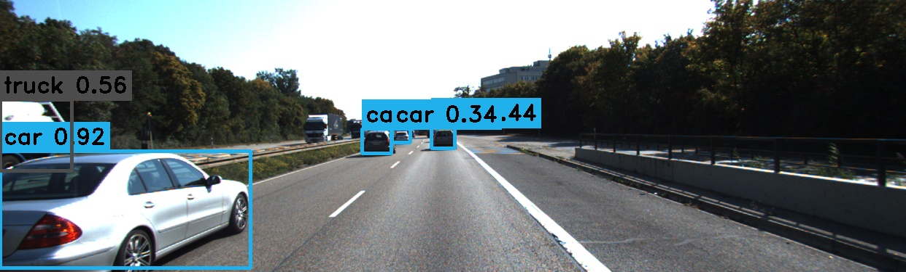

# YOLOv12 TensorRT CPP


[](https://colab.research.google.com/drive/1kqo6J6jxTiGFjpCHrv6HA5InOIp07Awt?usp=sharing)


## Overview  

This project is a high-performance **C++ implementation** for real-time object detection using **YOLOv12**. It leverages **TensorRT** for optimized inference and **CUDA** for accelerated processing, enabling efficient detection on both images and videos. Designed for maximum speed and accuracy, this implementation ensures seamless integration with YOLOv12 models, making it suitable for deployment in research, production, and real-time applications.  

**Google Colab Support**: To make GPU-based inference more accessible, a **fully configured Google Colab notebook** is provided. This notebook allows users to **run the entire project from start to finish** using a **Google Colab T4 GPU**, including compiling and executing C++ code directly in Colab. This is especially helpful for those who **struggle with local GPU availability**.  

## **Note:** The Google Colab notebook is not meant for performance testing, as the performance will be poor. It is intended for learning how to integrate C++, TensorRT, and CUDA.


<p align="center">
   <br>
  Comparison with popular methods in terms of latency-accuracy (left) and FLOPs-accuracy (right) trade-offs
</p>


## Output

Below are examples of the output for both image and video inference:

<div align="center">
  <h3>Image Output</h3>
  
  
  <h3>Video Output</h3>
  
</div>


## Features

- **TensorRT Integration**: Optimized deep learning inference using **NVIDIA TensorRT**, ensuring high-speed execution on **GPU**.
- **Efficient Memory Management**: Uses **CUDA buffers** and **TensorRT engine caching** for improved performance.
- **Real-Time Inference**: Supports **image** and **video** processing, allowing smooth detection across frames.  
- **Custom Preprocessing & Postprocessing**: Handles **image normalization, tensor conversion, and result decoding** directly in CUDA for minimal overhead.  
- **High-Performance Video Processing**: Efficiently processes video streams using OpenCV while maintaining low-latency inference with TensorRT.
- **Google Colab Support**: A **ready-to-use Google Colab Notebook** is provided to **run the project in Google Colab**, enabling easy setup and execution without requiring a local GPU.  

## Requirements

Before building the project, ensure that the following dependencies are installed on your system:

- **C++ Compiler**: Compatible with **C++17** or higher.  
- **CMake**: Version **3.12** or higher.  
- **CUDA**: Version **12.4** .  
- **TensorRT**: Tested with **TensorRT 10.8.0** for high-performance inference.  
- **OpenCV**: Version **4.5.4** or higher for image and video processing.  

## Installation And Usage

### 1- Generate ONNX models
Generate the onnx version of the yolov12 model, You can use the same way defined in this repo [YOLOv12 ONNX CPP](https://github.com/mohamedsamirx/YOLOv12-ONNX-CPP.git).

### 2- Clone Repository
Clone the repository to your local machine:

```bash 
git https://github.com/mohamedsamirx/YOLOv12-TensorRT-CPP.git
cd YOLOv12-TensorRT-CPP
```

### 3- Build the C++ Code
  **Ensure that OpenCV and TensorRT are installed. Set the correct paths for these libraries in the** `CMakeLists.txt` **file.**
  
```bash
mkdir build && cd build
cmake ..
cmake --build . --config Release
```

### 4- Create a TensorRT Engine

Convert the ONNX model to a TensorRT engine:

```bash
./yolov12-tensorrt.exe yolo12n.onnx ""
```

### 5- Run Inference on an Image

Perform object detection on an image:

```bash
./yolov12-tensorrt.exe yolo12n.engine "zidane.jpg"
```

### 6- Run Inference on a Video

Perform object detection on a video:

```bash
./yolov12-tensorrt.exe yolo12n.engine "road.mp4"
```

### License
This project is licensed under the GNU Affero General Public License v3.0 (AGPL-3.0). See the [LICENSE](LICENSE) file for details.

### Acknowledgment

- [https://github.com/spacewalk01/yolov11-tensorrt](https://github.com/spacewalk01/yolov11-tensorrt)
- [https://github.com/sunsmarterjie/yolov12](https://github.com/sunsmarterjie/yolov12)